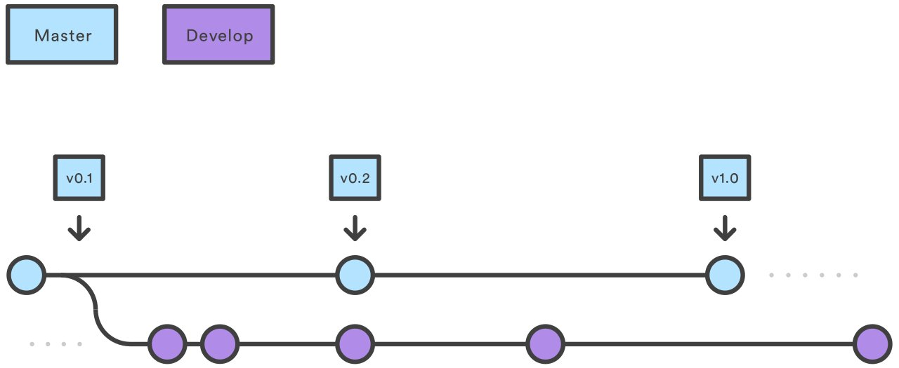

## What is Git Workflow?

Git Workflow design showcases a bracing model designed around the project. This provides a robust framework for a collaborate team to follow. Git Workflow use of branching helps elevate team's collaborate work because of its ease to not only review but merge branches without slowing down production.  

*This image helps visualize gitFlow.* 
* First, create a branch from master branch where you will perform features or fixes(name them as such)
* Second, edit all changes you want to make then commit those changes to the master
* Third, you or your team member will be able see a pull request for project 
* Finally, if no errors occur you will be able to merge the features and fixes to the master branch.

## Conclusion

Git Flow is a key tool for companys and should be simple but still enhance proudctivity for your team. Git Flow makes more clean quick changes to your coding through branches, if the branch does not merge well with the project team member can easliy review and correct quick, causing minimal delay, which is the goal teams aim for.  
